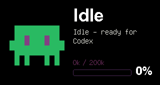
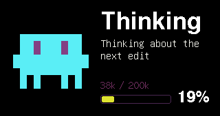
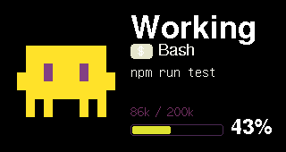
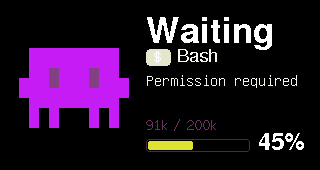
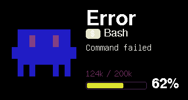
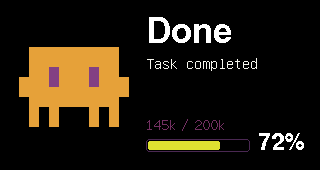

# Claudy 狀態截圖展示

以下圖片擷取自 ESP32-S3 的 `/screenshot.bmp` endpoint，解析度為 320x170。

所有範例都使用中立的假資料。若要在本機重現，請把 `<claudy-ip>` 換成你的裝置 IP。

## 閒置



## 思考中



## 工作中



## 等待中



## 錯誤



## 完成



## 重現方式

送出狀態後，再使用 ESP32-S3 的截圖 endpoint：

```bash
curl -X POST http://<claudy-ip>/state \
  -H 'Content-Type: application/json' \
  -d '{"state":"working","tool":"Bash","message":"npm run test","client":"codex-vscode","model":"gpt-5.5","tokens":{"used":86000,"max":200000}}'

curl http://<claudy-ip>/screenshot.bmp -o docs/state-screenshots/working.bmp
```
